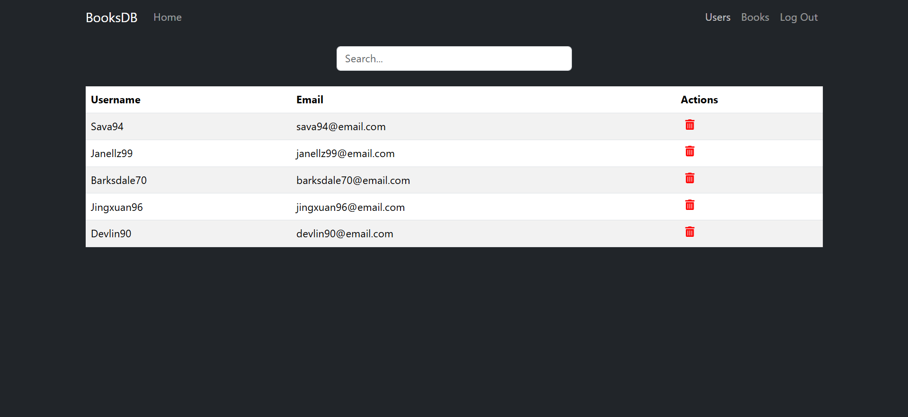
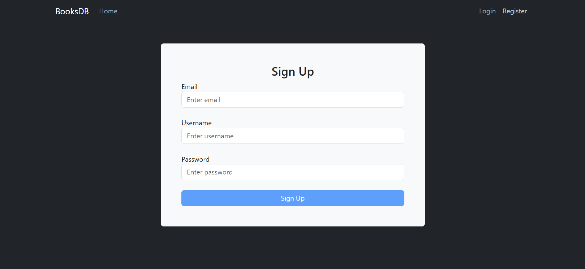
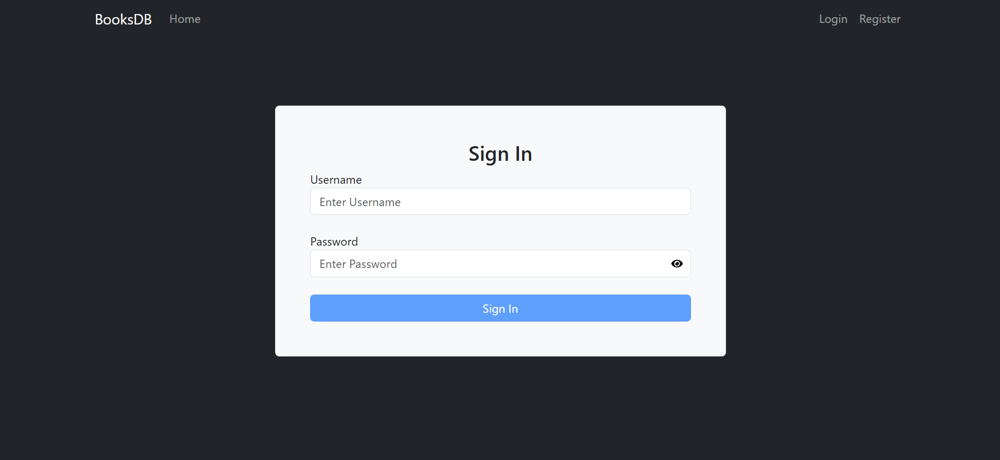

# BooksDB

### Description
A single-page application where users can find books, rate them and write reviews.

### Tech Stack
Typescript, React.js, Bootstrap, CSS, Express.js, MySQL

### Setup
Backend:
1. Inside the `server` folder, run `npm install` to restore all dependencies.
2. Set up a local database by importing the database schema from the `books` file in the `database` folder which contains some mock data for users, books, reviews and book ratings.
3. Inside the `server` folder, create a `.env` file with the following configuration:
```js
PORT=5555
HOST=localhost
DB_PORT=3306
USER= // insert MySQL database username
PASSWORD= // insert MySQL database password
DATABASE=books
PRIVATE_KEY=secretkey
```
4. Run `npm start`.

Frontend:
1. Inside the `client` folder, run `npm install` to restore all dependencies.
2. Run `npm start`.

### Pages
- Home page

- Books (1)

- Books (2)

- Single Book (1)

- Single Book (2)

- Users

- Register

- Login
